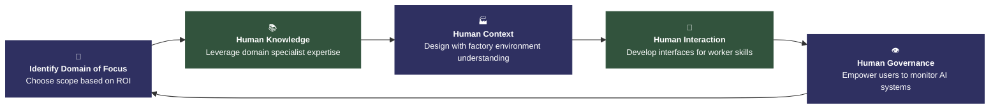

# Factory AI Implementation Approach

## Circular Process Diagram

This document contains a Mermaid diagram representing the Factory AI Implementation Approach as a circular process with five steps.

### Diagram Specifications

- **Type**: Circular loop with five steps, clockwise flow
- **Center title**: Factory AI Implementation Approach
- **Direction**: Clockwise arrows connecting each step
- **Visual Style**: Data Raven Minimalist
- **Colors**: 
  - Main dark blue: #2F3061
  - Secondary dark green: #32533D
  - Black: #000000
- **Typography**: Assistant font family
- **Background**: White
- **Aspect Ratio**: 16:9 for LinkedIn post

### Process Steps

1. **Identify Domain of Focus** - Choose the scope of focus based on ROI or other business priorities
2. **Human Knowledge** - Leverage the expertise of domain specialists to identify suitable AI applications
3. **Human Context** - Design with an understanding of how factory environments and work processes operate
4. **Human Interaction** - Develop interfaces and workflows that complement worker skills and experience
5. **Human Governance** - Empower users to understand, monitor, and control AI systems responsibly

---

## Clean Circular Mermaid Diagram

---

## Design Notes

- **Icons**: Each step includes a minimalist geometric icon (target, book, factory, connection, eye)
- **Color Scheme**: Alternating between dark blue (#2F3061) and dark green (#32533D)
- **Typography**: Clean, centered text with bold titles and regular descriptions
- **Layout**: Circular flow with clear directional arrows
- **White Space**: Maintained 30% white space around the design
- **Style**: Ultra-thin lines, no gradients or shadows, outline-only design

## Export Instructions

1. Copy the Mermaid code from either diagram above
2. Use a Mermaid renderer (GitHub, Mermaid Live Editor, or similar)
3. Export as high-resolution PNG
4. Ensure 16:9 aspect ratio for LinkedIn optimization
5. Background should be white with the specified color scheme

