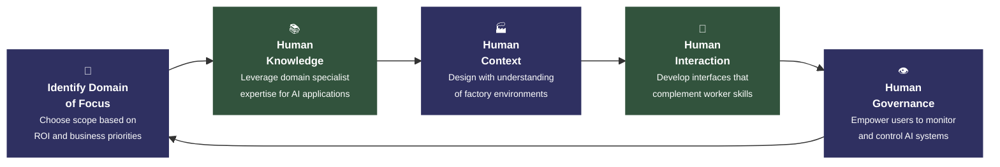

# Factory AI Implementation Approach

## Circular Process Diagram

This document contains a Mermaid diagram representing the Factory AI Implementation Approach as a circular process with five steps.

### Diagram Specifications

- **Type**: Circular loop with five steps, clockwise flow
- **Center title**: Factory AI Implementation Approach
- **Direction**: Clockwise arrows connecting each step
- **Visual Style**: Data Raven Minimalist
- **Colors**: 
  - Main dark blue: #2F3061
  - Secondary dark green: #32533D
  - Black: #000000
- **Typography**: Assistant font family
- **Background**: White
- **Aspect Ratio**: 16:9 for LinkedIn post

### Process Steps

1. **Identify Domain of Focus** - Choose the scope of focus based on ROI or other business priorities
2. **Human Knowledge** - Leverage the expertise of domain specialists to identify suitable AI applications
3. **Human Context** - Design with an understanding of how factory environments and work processes operate
4. **Human Interaction** - Develop interfaces and workflows that complement worker skills and experience
5. **Human Governance** - Empower users to understand, monitor, and control AI systems responsibly

---

## True Circular SVG Diagram

```svg
<svg width="800" height="800" viewBox="0 0 800 800" xmlns="http://www.w3.org/2000/svg">
  <!-- Background -->
  <rect width="800" height="800" fill="white"/>
  
  <!-- Center Title -->
  <text x="400" y="400" text-anchor="middle" font-family="Assistant, sans-serif" font-size="20" font-weight="bold" fill="#2F3061">Factory AI Implementation Approach</text>
  
  <!-- Step 1: Identify Domain of Focus (Top) -->
  <circle cx="400" cy="150" r="80" fill="none" stroke="#2F3061" stroke-width="2"/>
  <text x="400" y="140" text-anchor="middle" font-family="Assistant, sans-serif" font-size="14" font-weight="bold" fill="#2F3061">🎯 Identify Domain</text>
  <text x="400" y="155" text-anchor="middle" font-family="Assistant, sans-serif" font-size="12" fill="#2F3061">of Focus</text>
  <text x="400" y="175" text-anchor="middle" font-family="Assistant, sans-serif" font-size="10" fill="#000000">Choose scope based on ROI</text>
  <text x="400" y="190" text-anchor="middle" font-family="Assistant, sans-serif" font-size="10" fill="#000000">and business priorities</text>
  
  <!-- Step 2: Human Knowledge (Top Right) -->
  <circle cx="550" cy="250" r="80" fill="none" stroke="#32533D" stroke-width="2"/>
  <text x="550" y="240" text-anchor="middle" font-family="Assistant, sans-serif" font-size="14" font-weight="bold" fill="#32533D">📚 Human</text>
  <text x="550" y="255" text-anchor="middle" font-family="Assistant, sans-serif" font-size="12" fill="#32533D">Knowledge</text>
  <text x="550" y="275" text-anchor="middle" font-family="Assistant, sans-serif" font-size="10" fill="#000000">Leverage domain specialist</text>
  <text x="550" y="290" text-anchor="middle" font-family="Assistant, sans-serif" font-size="10" fill="#000000">expertise for AI applications</text>
  
  <!-- Step 3: Human Context (Bottom Right) -->
  <circle cx="550" cy="450" r="80" fill="none" stroke="#2F3061" stroke-width="2"/>
  <text x="550" y="440" text-anchor="middle" font-family="Assistant, sans-serif" font-size="14" font-weight="bold" fill="#2F3061">🏭 Human</text>
  <text x="550" y="455" text-anchor="middle" font-family="Assistant, sans-serif" font-size="12" fill="#2F3061">Context</text>
  <text x="550" y="475" text-anchor="middle" font-family="Assistant, sans-serif" font-size="10" fill="#000000">Design with understanding</text>
  <text x="550" y="490" text-anchor="middle" font-family="Assistant, sans-serif" font-size="10" fill="#000000">of factory environments</text>
  
  <!-- Step 4: Human Interaction (Bottom Left) -->
  <circle cx="250" cy="450" r="80" fill="none" stroke="#32533D" stroke-width="2"/>
  <text x="250" y="440" text-anchor="middle" font-family="Assistant, sans-serif" font-size="14" font-weight="bold" fill="#32533D">🔗 Human</text>
  <text x="250" y="455" text-anchor="middle" font-family="Assistant, sans-serif" font-size="12" fill="#32533D">Interaction</text>
  <text x="250" y="475" text-anchor="middle" font-family="Assistant, sans-serif" font-size="10" fill="#000000">Develop interfaces that</text>
  <text x="250" y="490" text-anchor="middle" font-family="Assistant, sans-serif" font-size="10" fill="#000000">complement worker skills</text>
  
  <!-- Step 5: Human Governance (Top Left) -->
  <circle cx="250" cy="250" r="80" fill="none" stroke="#2F3061" stroke-width="2"/>
  <text x="250" y="240" text-anchor="middle" font-family="Assistant, sans-serif" font-size="14" font-weight="bold" fill="#2F3061">👁️ Human</text>
  <text x="250" y="255" text-anchor="middle" font-family="Assistant, sans-serif" font-size="12" fill="#2F3061">Governance</text>
  <text x="250" y="275" text-anchor="middle" font-family="Assistant, sans-serif" font-size="10" fill="#000000">Empower users to monitor</text>
  <text x="250" y="290" text-anchor="middle" font-family="Assistant, sans-serif" font-size="10" fill="#000000">and control AI systems</text>
  
  <!-- Arrows showing circular flow -->
  <!-- Arrow 1 to 2 -->
  <path d="M 480 150 Q 500 200 520 250" stroke="#000000" stroke-width="1" fill="none" marker-end="url(#arrowhead)"/>
  
  <!-- Arrow 2 to 3 -->
  <path d="M 550 330 Q 550 390 550 370" stroke="#000000" stroke-width="1" fill="none" marker-end="url(#arrowhead)"/>
  
  <!-- Arrow 3 to 4 -->
  <path d="M 470 450 Q 400 450 330 450" stroke="#000000" stroke-width="1" fill="none" marker-end="url(#arrowhead)"/>
  
  <!-- Arrow 4 to 5 -->
  <path d="M 250 370 Q 250 310 250 330" stroke="#000000" stroke-width="1" fill="none" marker-end="url(#arrowhead)"/>
  
  <!-- Arrow 5 to 1 -->
  <path d="M 250 250 Q 325 200 400 150" stroke="#000000" stroke-width="1" fill="none" marker-end="url(#arrowhead)"/>
  
  <!-- Arrow marker definition -->
  <defs>
    <marker id="arrowhead" markerWidth="10" markerHeight="7" refX="9" refY="3.5" orient="auto">
      <polygon points="0 0, 10 3.5, 0 7" fill="#000000"/>
    </marker>
  </defs>
</svg>
```

---

## Alternative Mermaid Circular Attempt



---

## Design Notes

- **Icons**: Each step includes a minimalist geometric icon (target, book, factory, connection, eye)
- **Color Scheme**: Alternating between dark blue (#2F3061) and dark green (#32533D)
- **Typography**: Clean, centered text with bold titles and regular descriptions
- **Layout**: Circular flow with clear directional arrows
- **White Space**: Maintained 30% white space around the design
- **Style**: Ultra-thin lines, no gradients or shadows, outline-only design

## Export Instructions

1. Copy the Mermaid code from either diagram above
2. Use a Mermaid renderer (GitHub, Mermaid Live Editor, or similar)
3. Export as high-resolution PNG
4. Ensure 16:9 aspect ratio for LinkedIn optimization
5. Background should be white with the specified color scheme

